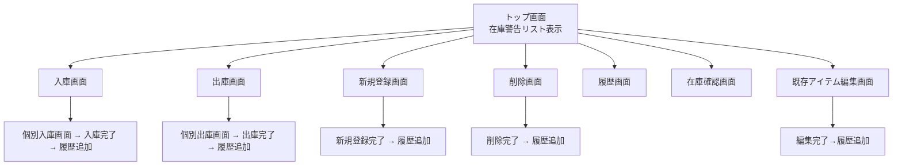

#zaikon 画面遷移図

```mermaid
flowchart 
A[トップ画面<br>在庫警告リスト表示]
A --> B[入庫画面]
A --> C[出庫画面]
A --> D[新規登録画面]
A --> E[削除画面]
A --> F[履歴画面]
A --> G[在庫確認画面]
A --> H[既存アイテム編集画面]


B --> B1[個別入庫画面 → 入庫完了 → 履歴追加]
C --> C1[個別出庫画面 → 出庫完了 → 履歴追加]
D --> J[新規登録完了 → 履歴追加]
E --> K[削除完了 → 履歴追加]
H --> H1[編集完了→履歴追加]


```

